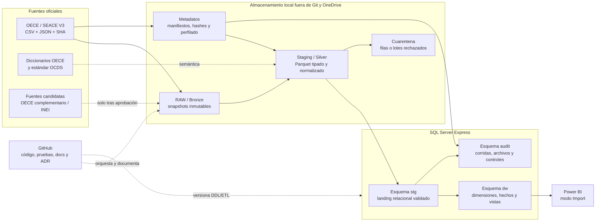
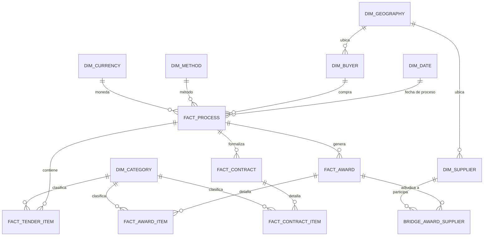
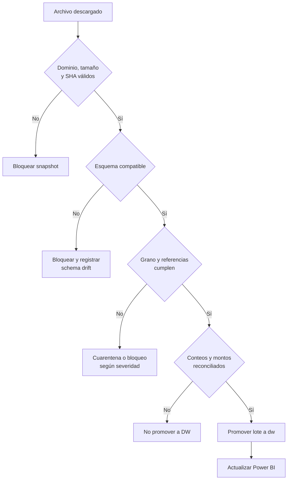

# Fase 3 — Arquitectura objetivo de datos y BI

## Objetivo

Definir cómo convertir snapshots oficiales de OECE/SEACE en un modelo analítico reproducible, auditable y apto para Power BI, sin mezclar granularidades ni perder la evidencia del origen. Esta fase fija contratos y responsabilidades; la implementación de ETL, SQL y visualizaciones corresponde a fases posteriores.

## Principios de diseño

1. **RAW inmutable:** un archivo oficial descargado nunca se edita ni sobrescribe.
2. **Trazabilidad de extremo a extremo:** toda fila procesada conserva fuente, periodo, snapshot, corrida y hash del archivo.
3. **Granularidad explícita:** cada tabla y medida declara su unidad de observación.
4. **Historia separada del hecho analítico:** los releases sirven para auditoría; el record compilado alimenta el estado consolidado.
5. **Calidad antes de publicación:** un fallo crítico impide promover datos a consumo.
6. **Datos fuera de Git:** GitHub conserva código, documentación, configuración no sensible y evidencia resumida, no archivos RAW ni PBIX.
7. **Una sola ruta hacia Power BI:** los reportes consumen vistas gobernadas del Data Warehouse, no ZIP, CSV o tablas temporales.

## Flujo objetivo



## Capas y contratos

| Capa | Ubicación | Contenido | Contrato de entrada | Contrato de salida |
|---|---|---|---|---|
| Registro de fuentes | Git: `config/source_registry.yml` | Publicadores, enlaces, estado de uso y adquisiciones | Fuente oficial verificada | Documento de trazabilidad validado |
| RAW / Bronze | `${DATA_ROOT}/raw` | ZIP, JSON y SHA exactos del publicador | Descarga HTTPS y manifiesto | Archivo inmutable, tamaño y SHA-256 |
| Metadata | `${DATA_ROOT}/metadata` | Manifiestos, esquema, perfil, conteos y controles | RAW identificado por snapshot | Evidencia estructurada por corrida |
| Staging / Silver | `${DATA_ROOT}/interim/staging` | Parquet tipado, normalizado y deduplicado | RAW con checksum y esquema aceptados | Tablas por grano con linaje técnico |
| Cuarentena | `${DATA_ROOT}/interim/quarantine` | Registros rechazados y motivo | Fallo de una regla recuperable | Evidencia para corrección, nunca consumo BI |
| SQL `stg` | SQL Server | Copia relacional de Silver | Lote validado e idempotente | Datos conciliados por snapshot |
| SQL `audit` | SQL Server | Corridas, archivos, métricas, reglas y errores | Eventos de todas las capas | Bitácora consultable y reconciliable |
| SQL `dw` | SQL Server | Modelo dimensional y vistas semánticas | `stg` aprobado por calidad | Modelo estable para Power BI |
| Power BI | Archivo local / servicio futuro | Medidas, visuales y narrativa | Vistas `dw.vw_*` | KPIs con periodo, moneda y grano explícitos |

### Estructura física prevista

```text
${DATA_ROOT}/
├── raw/oece/ocds/seace_v3/{yyyy}/{mm}/snapshot_date={yyyy-mm-dd}/
├── metadata/oece/ocds/seace_v3/{yyyy}/{mm}/snapshot_date={yyyy-mm-dd}/
├── interim/staging/oece_ocds/{table}/source_period={yyyy-mm}/snapshot_date={yyyy-mm-dd}/
├── interim/quarantine/{rule_id}/ingestion_run_id={uuid}/
└── processed/exports/                 # solo si un consumidor aprobado lo requiere
```

La partición `source_period` representa el corte declarado por OECE; `snapshot_date` identifica cuándo se obtuvo. No son intercambiables.

## Linaje técnico obligatorio

Toda tabla de Silver y `stg` incorporará estas columnas, además de las variables de negocio:

| Columna | Uso |
|---|---|
| `source_id` | Identificador del registro maestro de fuentes |
| `source_period` | Año y mes con que el publicador segmentó el archivo |
| `snapshot_date` | Fecha local en que se obtuvo el snapshot |
| `ingestion_run_id` | UUID de la ejecución reproducible |
| `source_file_name` | Nombre exacto del artefacto descargado |
| `source_file_sha256` | Huella SHA-256 del archivo físico |
| `source_table_name` | Tabla o miembro de origen dentro del ZIP |
| `source_row_number` | Posición de la fila en la tabla fuente |
| `ocid` | Identificador del proceso OCDS, cuando corresponda |
| `loaded_at_utc` | Momento de carga técnica, no fecha de negocio |

Las claves sustitutas del Data Warehouse no reemplazan estas claves naturales y de linaje; ambas se conservarán.

## Staging relacional

El piloto confirmó 22 tablas y una relación raíz/hijas consistente. El diseño de `stg` mantiene sus granularidades, pero normaliza nombres y tipos.

| Entidad `stg` prevista | Fuente piloto | Grano candidato |
|---|---|---|
| `stg.procurement_process` | `records.csv` | `ocid` |
| `stg.release_history` | `releases.csv` | `ocid + release_id` |
| `stg.process_source` | `com_sources.csv` | `ocid + source_id` |
| `stg.party` | `com_parties.csv` | `ocid + party_id` |
| `stg.party_additional_identifier` | `com_par_additionalIdentifiers.csv` | `ocid + party_id + additional_id + scheme` |
| `stg.tenderer` | `com_ten_tenderers.csv` | `ocid + tenderer_id` |
| `stg.tender_document` | `com_ten_documents.csv` | `ocid + tender_document_id` |
| `stg.tender_item` | `com_ten_items.csv` | `ocid + tender_item_id` |
| `stg.tender_item_classification` | `com_ten_ite_additionalClassific.csv` | `ocid + tender_item_id + classification_id` |
| `stg.tender_item_exchange_rate` | `com_ten_ite_tot_exchangeRates.csv` | `ocid + tender_item_id + currency` después de deduplicación controlada |
| `stg.award` | `com_awards.csv` | `ocid + award_id` |
| `stg.award_supplier` | `com_awa_suppliers.csv` | `ocid + award_id + supplier_id` |
| `stg.award_item` | `com_awa_items.csv` | `ocid + award_id + award_item_id` |
| `stg.award_item_classification` | tabla homóloga de adjudicación | `ocid + award_id + item_id + classification_id` |
| `stg.award_exchange_rate` | tablas de cambio de adjudicación | clave de adjudicación/ítem + moneda |
| `stg.contract` | `com_contracts.csv` | `ocid + contract_id` |
| `stg.contract_document` | `com_con_documents.csv` | `ocid + contract_id + document_id` |
| `stg.contract_item` | `com_con_items.csv` | `ocid + contract_id + item_id` |
| `stg.contract_item_classification` | tabla homóloga de contrato | `ocid + contract_id + item_id + classification_id` |
| `stg.contract_exchange_rate` | tablas de cambio de contrato | clave de contrato/ítem + moneda |

Los nombres y claves son contratos preliminares. La Fase 4 deberá verificar tipos y claves con todos los meses de 2023–julio 2026 antes de crear DDL definitivo.

## Modelo dimensional preliminar



### Dimensiones previstas

- `dw.dim_date`: calendario, año, trimestre, mes y banderas YTD comparable.
- `dw.dim_buyer`: entidad compradora normalizada y sus identificadores.
- `dw.dim_supplier`: proveedor normalizado; identidad histórica se definirá tras analizar cambios.
- `dw.dim_category`: jerarquía UNSPSC y miembro “Sin clasificar”.
- `dw.dim_geography`: UBIGEO y nombres normalizados; queda bloqueada hasta aprobar una versión oficial INEI.
- `dw.dim_procurement_method`: método general y detalle publicado por OECE.
- `dw.dim_currency`: moneda original y reglas de conversión a PEN.

### Hechos y puentes previstos

| Tabla | Grano | Medidas principales | Regla de uso |
|---|---|---|---|
| `dw.fact_procurement_process` | un `ocid` | valor de licitación, valor PEN, número de ofertantes | Indicadores de demanda y competencia |
| `dw.fact_tender_item` | un ítem de licitación por proceso | cantidad, valor unitario/total cuando exista | Análisis de demanda por categoría |
| `dw.fact_award` | una adjudicación por proceso | valor adjudicado original y PEN | Resultado adjudicado sin expandir por proveedor |
| `dw.fact_award_item` | un ítem por adjudicación | cantidad y valor a grano de ítem | Mix adjudicado por categoría |
| `dw.fact_contract` | un contrato por proceso | valor contractual original y PEN | Formalización contractual, no ejecución final |
| `dw.fact_contract_item` | un ítem por contrato | cantidad y valor a grano de ítem | Mix contractual por categoría |
| `dw.bridge_process_tenderer` | proceso-ofertante | indicador de participación | Evita duplicar el proceso al analizar ofertantes |
| `dw.bridge_award_supplier` | adjudicación-proveedor | ponderación futura si aplica | Evita duplicar el valor de adjudicación en consorcios |

Una medida monetaria solo podrá agregarse desde la tabla donde su grano es nativo. No se sumará `fact_award.amount` después de expandir una adjudicación por proveedores o ítems, salvo que exista una regla de asignación documentada.

## Tratamiento temporal y monetario

- Los años 2023, 2024 y 2025 se analizarán completos.
- El periodo YTD aprobado es enero–julio de 2026.
- La comparación interanual válida será enero–julio 2025 frente a enero–julio 2026.
- `source_period` no reemplaza fechas de convocatoria, adjudicación o contrato.
- Se conservarán monto y moneda originales, monto PEN publicado por OECE, tasa aplicada y resultado calculado.
- Cualquier recalculo deberá conciliar contra `amount_PEN`; diferencias fuera de tolerancia se enviarán a auditoría.

## Puertas de calidad



| Puerta | Controles mínimos | Severidad de bloqueo |
|---|---|---|
| Adquisición | HTTPS oficial, tamaño positivo, SHA local, checksum JSON oficial | Crítica |
| Esquema | tablas/columnas esperadas, tipos convertibles, columnas nuevas o ausentes | Crítica ante pérdida; advertencia ante adición compatible |
| Grano | claves completas, duplicados exactos y de clave candidata | Crítica en raíz/hechos; cuarentena en filas recuperables |
| Referencial | `ocid`, release, adjudicación y contrato padre existentes | Crítica si rompe integridad |
| Validez | fechas, moneda, identificadores, cantidades y montos | Según campo y cobertura |
| Completitud | umbrales por campo/rol, nunca una tasa global sin contexto | Advertencia o crítica según KPI |
| Reconciliación | filas RAW→Silver→`stg`→`dw`; montos original/PEN | Crítica |

Hallazgos del piloto que se convierten en reglas explícitas:

- Los 10 duplicados exactos de tasas de cambio de ítems de licitación se medirán antes y después de deduplicar.
- Una clasificación adicional sin código ni descripción se conservará como rechazada o “Sin clasificar”; no se inventará un código.
- La clasificación principal de ítems tiene 17.41% de nulos y requerirá una categoría desconocida visible.
- `implementation/finalValue` y la fecha final de ejecución superan 99% de nulos; no habilitan KPIs de ejecución contractual.

## Auditoría e idempotencia

El esquema `audit` deberá incluir, como mínimo:

- `audit.ingestion_run`: inicio, fin, estado, versión de código y parámetros.
- `audit.source_file`: fuente, URL, periodo, snapshot, tamaño, hashes y ruta RAW.
- `audit.table_load`: filas leídas, aceptadas, rechazadas e insertadas por tabla.
- `audit.quality_result`: regla, severidad, métrica, umbral, resultado y muestra controlada.
- `audit.reconciliation`: conteos y montos comparados entre capas.

La clave operativa de un lote será `source_id + source_period + snapshot_date + source_file_sha256`. Reejecutar el mismo lote producirá el mismo resultado o lo marcará como ya procesado; no duplicará hechos.

## Consumo en Power BI

- Modo inicial: **Import**, apropiado para SQL Server Express y el volumen observado.
- Conexión exclusiva a vistas `dw.vw_*` con nombres y tipos estables.
- Esquema estrella, relaciones uno-a-muchos y dirección de filtro simple por defecto.
- Tabla de fechas única y comparaciones YTD encapsuladas en medidas.
- Medidas monetarias separadas para moneda original y PEN.
- Cada página mostrará periodo de corte, universo y última corrida aprobada.
- Los indicadores de riesgo serán señales analíticas, no conclusiones legales ni acusaciones.

## Seguridad, privacidad y versionado

- Secretos y cadenas de conexión permanecen en `.env`, fuera de Git.
- RAW, Parquet, bases locales, logs y PBIX permanecen fuera del repositorio.
- Los reportes de errores no expondrán datos personales innecesarios.
- DDL, ETL, pruebas, registro de fuentes, reglas de calidad y ADR sí se versionarán.
- La licencia MIT aplica al código; cada dataset conserva los términos de su publicador.

## Capacidad y evolución

El piloto de un mes produjo 8.05 MB de CSV comprimido, 65.84 MB descomprimido y 231,123 filas acumuladas. El alcance completo cabe razonablemente en una solución local con Parquet y SQL Server Express, pero la Fase 4 medirá el volumen real antes de fijar índices, particiones o política de retención. Si el límite operativo de Express se acerca, la migración a SQL Server Developer para desarrollo o a una instancia administrada no cambiará los contratos de capas.

## Decisiones aplazadas

- Claves sustitutas y manejo Slowly Changing Dimension para compradores/proveedores.
- Regla de asignación de montos cuando una adjudicación tenga varios proveedores.
- Versión exacta de UBIGEO y estrategia de geocodificación.
- Umbrales finales por regla de calidad, después del perfil histórico.
- Incremental refresh en Power BI, después de medir tamaño y frecuencia.
- Incorporación de órdenes, sanciones, PAC y otras fuentes complementarias.

### Cierre de decisiones en Fase 6

La Fase 6 aprobó la constelación de 8 dimensiones, 6 hechos y 2 puentes, claves sustitutas con miembro 0, SCD Tipo 1 para compradores/proveedores y atribución monetaria únicamente con proveedor único. El contrato vigente está en `config/dimensional_model.yml` y reemplaza el diseño dimensional preliminar de esta sección. Geografía, SCD Tipo 2 y fuentes complementarias continúan aplazadas.

### Implementación física en Fase 7

La Fase 7 materializó 22 tablas `stg`, 16 tablas `dw` y 2 tablas `audit` en SQL Server Express. La carga usa reemplazo de snapshot transaccional, bloqueo de aplicación, hashes del bundle DDL, auditoría persistente e idempotencia por contrato y conteos. La estrategia incremental histórica continúa aplazada hasta la Fase 15; el diseño físico vigente está en `config/sql_server.yml` y `sql/ddl/`.

### Puerta de validación en Fase 8

La Fase 8 materializó la puerta prevista sin alterar el warehouse: 45 reglas T-SQL comprueban estructura, grano, integridad, linaje, atribución y cálculos; 113 reconciliaciones contrastan SQL con auditoría, Silver y evidencia Python. El contrato vigente está en `config/sql_validation.yml`. Solo un resultado sin fallos bloqueantes habilita la Fase 9, mientras las advertencias oficiales permanecen visibles y condicionan el uso de KPIs posteriores.

### Exploración gobernada en Fase 9

La Fase 9 consume exclusivamente el modelo `dw` aprobado por la puerta anterior. Diez datasets SQL versionados preservan sus granos nativos y alimentan perfiles descriptivos, rankings exploratorios y siete figuras reproducibles. El contrato vigente está en `config/eda.yml`; cada ejecución registra hashes de configuración, consultas, ejecutor y gráficos. Con un solo `source_period`, crecimiento, YoY y tendencias históricas permanecen inhabilitados; concentración, scores y KPIs se reservan para sus fases posteriores.

### Capa semántica de KPIs en Fase 10

La Fase 10 formaliza 21 métricas con definición, grano, unidad, numerador y denominador. SQL calcula desde cada hecho nativo, Python reconcilia contra el EDA y DAX conserva medidas equivalentes para Power BI. El contrato vigente está en `config/kpis.yml`. Siete métricas permanecen bloqueadas por falta de historia, geografía, cobertura o por pertenecer a concentración y scores posteriores.

## Criterios de aceptación para pasar a Fase 4

- Registro maestro de fuentes estructuralmente válido y documento sincronizado.
- Arquitectura, capas, granos y responsabilidades documentados.
- Fuente piloto con archivos, hashes, periodo y snapshot trazables.
- Fuentes candidatas distinguidas de las realmente utilizadas.
- Hallazgos de perfilado convertidos en reglas de diseño/calidad.
- Pruebas automatizadas y revisión de enlaces oficiales aprobadas.
