# Fase 6 — Modelo dimensional lógico

## Objetivo y alcance

La Fase 6 convierte las 22 tablas Silver en un contrato lógico para el esquema `dw`. El modelo separa procesos, ítems, adjudicaciones y contratos para que cada medida se agregue únicamente desde su grano nativo.

Esta fase define objetos, llaves, relaciones, mapeos, aditividad y reglas de atribución. No crea todavía DDL, no carga SQL Server y no publica KPIs; esas responsabilidades comienzan en la Fase 7.

El contrato canónico es `config/dimensional_model.yml` y su validación cuantitativa está en `reports/modeling/oece_ocds_seace_v3_2026_07_dimensional_model_analysis.json`.

## Qué significa el grano

El grano es la afirmación exacta de qué representa una fila. Se define antes de escoger columnas o medidas.

Ejemplo: `fact_award` representa una adjudicación identificada por `ocid + award_id`. El monto adjudicado debe aparecer una sola vez. Expandirlo primero por ítems y proveedores multiplicaría el importe cuando existan varias filas hijas.

## Evidencia que determina el diseño

- 6,452 procesos únicos.
- Hasta 80 ofertantes, 5 adjudicaciones y 4 contratos por proceso.
- Hasta 32 ítems por adjudicación y 5 por contrato.
- 67 procesos presentan diferencias superiores a 0.01 entre monto de licitación y suma de ítems.
- Una adjudicación presenta diferencia superior a 0.01; todos los contratos concilian.
- 53 procesos difieren entre número de ofertantes declarado y observado.
- 3,396 de 3,397 adjudicaciones tienen exactamente un proveedor; una no informa proveedor.
- Existen cuatro identidades de proveedor con variantes de nombre y tres categorías con variantes de descripción.
- Hay tasas OECE faltantes para dos ítems de licitación y cuatro contratos/ítems en moneda extranjera.
- `finalValue` solo está disponible en 3 de 1,119 contratos.

## Alternativa aprobada

Se aprobó una constelación de hechos con dimensiones conformadas. Se descartaron:

- una tabla ancha por proceso, porque agregaría o duplicaría relaciones uno-a-muchos;
- un hecho único de ciclo de vida, porque mezclaría demanda, adjudicación y contrato;
- un modelo de releases como modelo BI principal, porque 80,789 releases describen historia operativa y no hechos monetarios independientes.

## Diagrama lógico

```mermaid
erDiagram
    DIM_PROCESS ||--|| FACT_PROCUREMENT_PROCESS : identifica
    DIM_PROCESS ||--o{ FACT_TENDER_ITEM : contiene
    DIM_PROCESS ||--o{ FACT_AWARD : genera
    DIM_PROCESS ||--o{ FACT_AWARD_ITEM : detalla
    DIM_PROCESS ||--o{ FACT_CONTRACT : formaliza
    DIM_PROCESS ||--o{ FACT_CONTRACT_ITEM : detalla
    DIM_PROCESS ||--o{ BRIDGE_PROCESS_TENDERER : recibe_oferta
    DIM_PROCESS ||--o{ BRIDGE_AWARD_SUPPLIER : adjudica

    DIM_BUYER ||--o{ FACT_PROCUREMENT_PROCESS : compra
    DIM_BUYER ||--o{ FACT_AWARD : compra
    DIM_BUYER ||--o{ FACT_CONTRACT : compra

    DIM_SUPPLIER ||--o{ BRIDGE_PROCESS_TENDERER : participa
    DIM_SUPPLIER ||--o{ BRIDGE_AWARD_SUPPLIER : provee
    DIM_SUPPLIER ||--o{ FACT_AWARD : atribucion_unica
    DIM_SUPPLIER ||--o{ FACT_CONTRACT : atribucion_unica

    DIM_CATEGORY ||--o{ FACT_TENDER_ITEM : clasifica
    DIM_CATEGORY ||--o{ FACT_AWARD_ITEM : clasifica
    DIM_CATEGORY ||--o{ FACT_CONTRACT_ITEM : clasifica

    DIM_DATE ||--o{ FACT_PROCUREMENT_PROCESS : fecha
    DIM_DATE ||--o{ FACT_AWARD : fecha
    DIM_DATE ||--o{ FACT_CONTRACT : fecha
    DIM_CURRENCY ||--o{ FACT_PROCUREMENT_PROCESS : moneda
    DIM_CURRENCY ||--o{ FACT_AWARD : moneda
    DIM_CURRENCY ||--o{ FACT_CONTRACT : moneda
    DIM_UNIT ||--o{ FACT_TENDER_ITEM : unidad
    DIM_UNIT ||--o{ FACT_AWARD_ITEM : unidad
    DIM_UNIT ||--o{ FACT_CONTRACT_ITEM : unidad
    DIM_PROCUREMENT_METHOD ||--o{ FACT_PROCUREMENT_PROCESS : metodo
```

Las relaciones de categoría, fecha y moneda son role-playing: existe una sola dimensión física y vistas semánticas con nombres de rol.

## Dimensiones

| Dimensión | Grano | Filas estimadas en el piloto | Política |
|---|---|---:|---|
| `dw.dim_date` | una fecha calendario | 2,135 | Tipo 0; calendario continuo 2026-02-02 a 2031-12-07 en el piloto |
| `dw.dim_process` | un `ocid` | 6,452 | Tipo 1; identidad y descriptores del proceso |
| `dw.dim_buyer` | un `source_party_id` comprador | 1,450 | Tipo 1; CONSUCODE y RUC alternativo |
| `dw.dim_supplier` | un `source_party_id` ofertante/proveedor | 12,820 | Tipo 1; conserva formato RUC y conflictos |
| `dw.dim_category` | esquema + código | 3,690 | Tipo 1; CUBSO, UNSPSC y clave desconocida 0 |
| `dw.dim_procurement_method` | método + detalle | 19 | Tipo 1 |
| `dw.dim_currency` | código de moneda | 4 | Tipo 1 |
| `dw.dim_unit` | esquema + código de unidad | 15 | Tipo 1 |

### SCD Tipo 1

Compradores, proveedores, categorías, métodos, monedas y unidades usan Type 1 porque la fuente no declara fechas efectivas fiables para cambios de atributos. La selección canónica será determinística:

1. valor no nulo más frecuente;
2. desempate lexical sobre texto normalizado;
3. conservación de `variant_count` y bandera de conflicto;
4. conservación del valor original y linaje en Silver/Staging.

No se simulan periodos de vigencia. SCD Tipo 2 solo se reconsiderará si una fuente oficial aporta fechas efectivas o si se aprueba una semántica de “observado desde”.

## Hechos y puentes

| Objeto | Grano | Filas piloto | Uso monetario |
|---|---|---:|---|
| `dw.fact_procurement_process` | `ocid` | 6,452 | presupuesto y valor de licitación |
| `dw.fact_tender_item` | `ocid + tender_item_id` | 7,359 | valor del ítem de licitación |
| `dw.fact_award` | `ocid + award_id` | 3,397 | valor adjudicado |
| `dw.fact_award_item` | `ocid + award_id + item_id` | 3,590 | valor del ítem adjudicado |
| `dw.fact_contract` | `ocid + contract_id` | 1,119 | valor contractual formalizado |
| `dw.fact_contract_item` | `ocid + contract_id + item_id` | 1,139 | valor del ítem contractual |
| `dw.bridge_process_tenderer` | `ocid + supplier_id` | 34,115 | prohibido propagar monto del proceso |
| `dw.bridge_award_supplier` | `ocid + award_id + supplier_id` | 3,396 | prohibido propagar monto adjudicado |

## Categorías CUBSO y UNSPSC

Cada hecho de ítem tendrá dos claves:

- `primary_category_key`: clasificación principal CUBSO;
- `standard_category_key`: clasificación adicional UNSPSC.

El piloto confirma máximo una clasificación adicional por ítem en las tres etapas. Si otro lote contiene más de una, `DM-CAT-001` bloqueará la carga y el diseño deberá migrar a un bridge item-categoría; no se descartará silenciosamente la segunda clasificación.

Las 2,135 ausencias originales convergen a `category_key = 0`, “Sin clasificar”. La bandera DQ permanece disponible.

## Atribución a proveedores

Los puentes representan participación, no asignación monetaria. La política es:

| Proveedores oficiales por adjudicación | `attributed_supplier_key` | Monto atribuible |
|---:|---|---|
| 0 | 0, sin proveedor informado | No |
| 1 | proveedor observado | Sí, 100% |
| >1 | 0, no atribuible | No, hasta contar con distribución oficial |

No se reparte el monto en partes iguales ni se replica a cada proveedor. En el piloto, 3,396 adjudicaciones y los 1,119 contratos son atribuibles; una adjudicación queda sin proveedor.

## Aditividad

| Medida | Regla |
|---|---|
| Conteos de procesos, ítems, adjudicaciones y contratos | Aditivos |
| Monto original | Aditivo solo dentro de una misma moneda |
| Monto PEN | Aditivo solo cuando existe valor publicado o conversión OECE disponible |
| Cantidad | Aditiva solo dentro de una misma unidad |
| Tasa, duración y diferencias de conciliación | No aditivas |
| Número de ofertantes | Sumable como observaciones, no como proveedores distintos |
| `finalValue` | No apto para KPI por cobertura insuficiente |

Los montos de cabecera e ítem no se sustituyen entre sí. Se almacenan en hechos separados y se añade una diferencia de auditoría con tolerancia de 0.01.

## Fechas y zona horaria

`dim_date` se construye dinámicamente desde la mínima hasta la máxima fecha de negocio aprobada. Los timestamps UTC de Silver se convierten primero a `America/Lima` y luego a fecha calendario.

Relaciones activas propuestas:

- proceso e ítem de licitación: fecha de publicación de la licitación;
- adjudicación e ítem: fecha de adjudicación;
- contrato e ítem: fecha de firma.

Las demás fechas se exponen mediante dimensiones role-playing o relaciones inactivas controladas.

## Moneda y conversión

- Se conserva monto y moneda originales.
- Para PEN, tasa técnica igual a 1.
- Para otra moneda, se usa exclusivamente la tasa a PEN publicada por OECE.
- Si la tasa falta, `amount_pen` queda nulo y `dq_pen_conversion_available=false`.
- No se busca una tasa externa ni se imputa promedio.

El piloto conserva sin conversión dos ítems de licitación y cuatro contratos/ítems en moneda extranjera.

## Linaje

Cada hecho conservará `source_id`, `source_period`, `snapshot_date`, `ingestion_run_id`, archivo, hash, tabla, fila y momento de carga. Las dimensiones conservarán primera/última observación y la corrida que aportó el valor canónico.

## Objetos fuera del modelo MVP

- `release_history`: Staging/Audit; no es un hecho de gasto.
- documentos: Staging o futuro modelo factless.
- tasas: Staging y derivación de hechos; no son medidas aditivas independientes.
- `dim_geography`: aplazada hasta ingerir una versión oficial de UBIGEO.
- `finalValue` como KPI: bloqueado por cobertura de 0.2681%.

## Condiciones para la Fase 7

- 6/6 puertas lógicas aprobadas.
- DDL generado desde este contrato, no diseñado nuevamente de forma manual.
- restricciones únicas para granos naturales;
- claves foráneas a dimensiones y miembro desconocido 0;
- carga idempotente por lote;
- reconciliación de filas Silver→`stg`→`dw`;
- ninguna medida monetaria en bridges.
