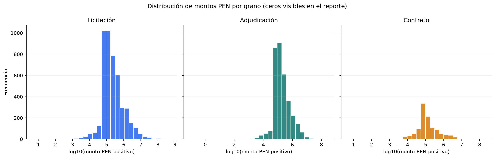
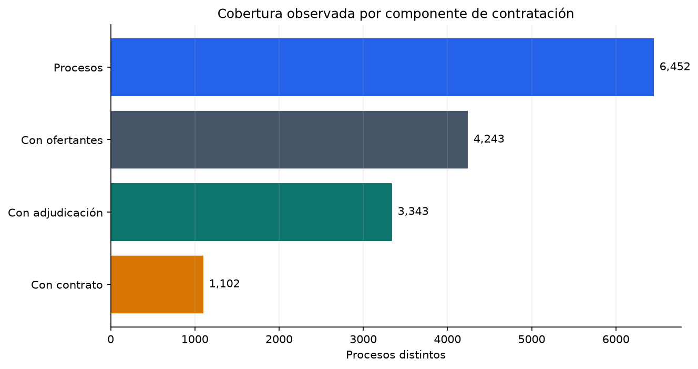
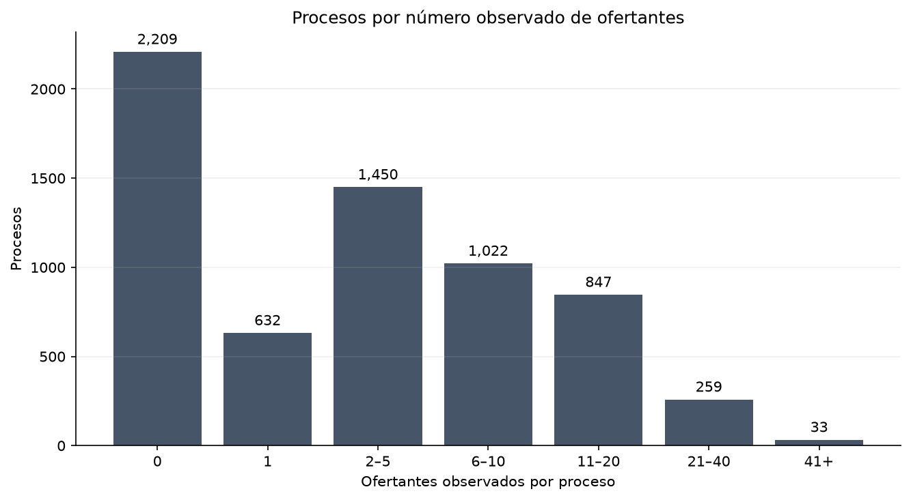
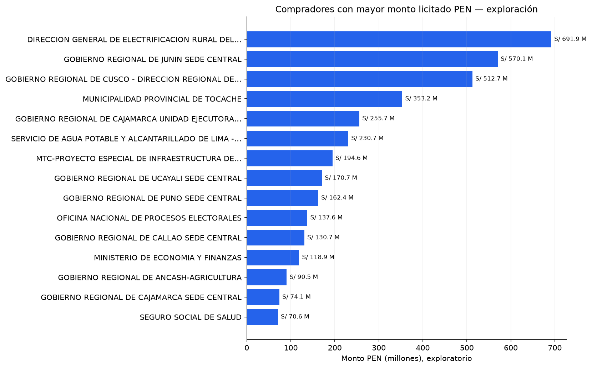
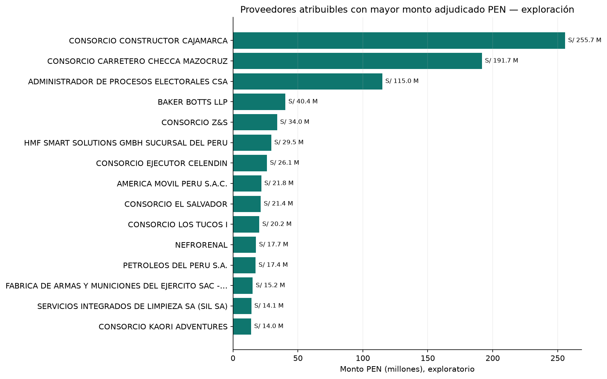
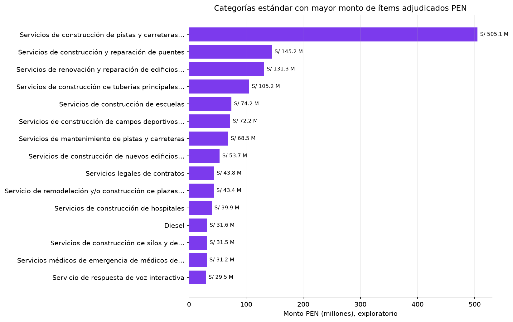

# Fase 9 — Exploratory Data Analysis

## Resultado ejecutivo

| Métrica | Resultado |
|---|---:|
| Estado | `PASS` |
| Lote SQL | 4 |
| Source period | 2026-07 |
| Datasets SQL | 10 |
| Figuras | 7 |
| Hallazgos documentados | 8 |
| Procesos analizados | 6,452 |
| Duración | 20.7347 s |
| Elegible para crecimiento/YoY | No |

La Fase 9 describe el piloto y determina aptitud para los siguientes módulos. No publica todavía KPIs, HHI, scores ni recomendaciones.

## Universo

| Objeto | Filas |
|---|---:|
| Procesos | 6,452 |
| Ítems de licitación | 7,359 |
| Adjudicaciones | 3,397 |
| Contratos | 1,119 |
| Compradores conocidos | 1,450 |
| Identidades proveedor/ofertante | 12,820 |
| Categorías conocidas | 3,689 |

## Distribución monetaria PEN

| Etapa/grano | Cobertura PEN | Ceros | Suma de control | Mediana | P90 | P99 | Máximo |
|---|---:|---:|---:|---:|---:|---:|---:|
| Licitación | 6,452/6,452 | 1,779 | S/ 6,924.92 M | S/ 98,743.77 | S/ 1.13 M | S/ 11.26 M | S/ 506.82 M |
| Adjudicación | 3,397/3,397 | 0 | S/ 2,375.75 M | S/ 143,280.00 | S/ 1.14 M | S/ 6.31 M | S/ 255.73 M |
| Contrato | 1,115/1,119 | 0 | S/ 652.17 M | S/ 99,450.00 | S/ 927,629.87 | S/ 4.84 M | S/ 191.70 M |

Las sumas son controles descriptivos de hechos distintos. No se suman entre etapas ni representan por sí solas impacto empresarial.

Los montos tienen cola derecha pronunciada. La mediana es mucho menor que el máximo, por lo que una media aislada sería poco representativa. Los valores extremos permanecen en el dataset.

## Cobertura por componente

- 4,243 procesos tienen al menos un ofertante observado.
- 3,343 tienen adjudicación.
- 1,102 tienen contrato.
- Estas cifras son cobertura observada, no una tasa de conversión causal ni secuencial.

## Competencia observada

- 2,209 procesos no tienen ofertantes en el detalle del bridge.
- Mediana: 3 ofertantes observados por proceso.
- P90: 15.
- P99: 34.
- Máximo: 80.
- 53 de 4,243 procesos comparables difieren entre conteo declarado y observado.

La distribución es adecuada para estudiar competencia en fases posteriores, siempre mostrando cobertura. Todavía no se calcula concentración.

## Exploración de compradores, proveedores y categorías

- Mayor comprador exploratorio por monto licitado PEN: Dirección General de Electrificación Rural del Ministerio de Energía y Minas, S/ 691.95 M en 7 procesos.
- Mayor proveedor atribuible por monto adjudicado PEN: Consorcio Constructor Cajamarca, S/ 255.73 M en una adjudicación.
- Mayor categoría estándar por monto de ítems adjudicados: `72141001`, servicios de construcción de pistas y carreteras nuevas, S/ 505.08 M.

Estos rankings pertenecen a un snapshot. No demuestran recurrencia, crecimiento, concentración sostenida ni oportunidad comercial.

## Cobertura y limitaciones cuantificadas

| Hallazgo | Casos | Denominador | Cobertura/incidencia |
|---|---:|---:|---:|
| Monto original de licitación cero | 1,752 | 6,452 | 27.1544% |
| Ofertantes declarados ≠ observados | 53 | 4,243 | 1.2491% |
| Categoría estándar desconocida — licitación | 1,282 | 7,359 | 17.4208% |
| Categoría estándar desconocida — adjudicación | 648 | 3,590 | 18.0501% |
| Categoría estándar desconocida — contrato | 205 | 1,139 | 17.9982% |
| Adjudicación sin proveedor atribuible | 1 | 3,397 | 0.0294% |
| Contrato sin PEN calculable | 4 | 1,119 | 0.3575% |
| Contrato sin valor final | 1,116 | 1,119 | 99.7319% |
| Comprador sin departamento crudo | 0 | 1,450 | 0% |
| Firma contractual posterior al snapshot | 1 | 1,119 | 0.0894% |

## Aptitud para fases siguientes

| Módulo | Decisión basada en evidencia |
|---|---|
| Spend descriptivo | Apto con cobertura y grano explícitos |
| Buyer/Supplier/Category rankings | Apto como exploración; metodología KPI pendiente |
| Distribución de competencia | Apta |
| Crecimiento y YoY | No apto con un solo source period |
| Geografía | Aplazada hasta dimensión UBIGEO oficial |
| Valor final | No apto por cobertura de 0.2681% |
| Market concentration | Aplazado a Fase 11 |
| Opportunity/Risk Scores | Aplazados a Fases 12 y 13 |

## Incidencias de ejecución y QA visual

- La primera corrida construyó la caché de fuentes de Matplotlib; es un costo inicial del entorno.
- La revisión visual detectó que el eje mensual categórico seguía el orden de aparición de las series. Se corrigió a un eje común cronológico febrero–agosto y se regeneraron todas las evidencias.
- Ninguna corrección modificó SQL Server o los datos fuente.

## Pruebas

- 10/10 consultas SQL ejecutadas contra el lote aprobado.
- 7/7 figuras generadas y revisadas visualmente.
- Hash y tamaño de cada PNG registrados.
- 64 pruebas pytest.
- Reconciliación del lote 4 contra la puerta de Fase 8.
- Verificación de ausencia de rutas privadas.

## Fuente

La fase no incorpora una fuente nueva. Usa el snapshot OECE/SEACE documentado en `docs/data_sources/source_registry.md` y validado en las fases anteriores.

## Evidencia

- `reports/eda/oece_ocds_seace_v3_2026_07_eda_summary.json`.
- `reports/eda/oece_ocds_seace_v3_2026_07_eda_report.md`.
- `reports/eda/figures/`.
- `config/eda.yml`.
- `sql/analytics/phase9_*.sql`.
