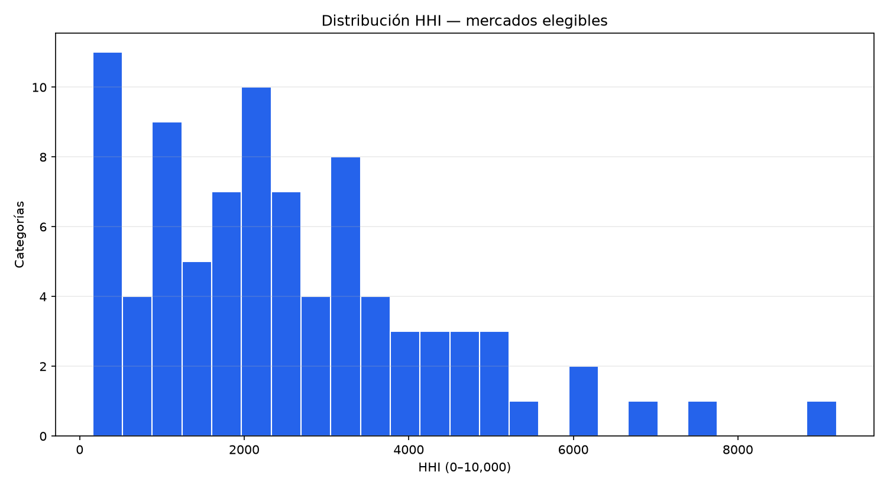
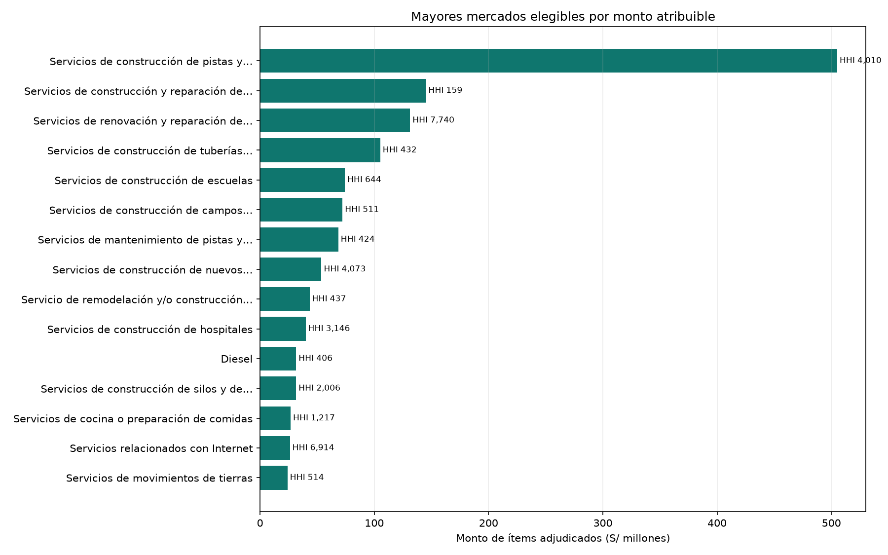
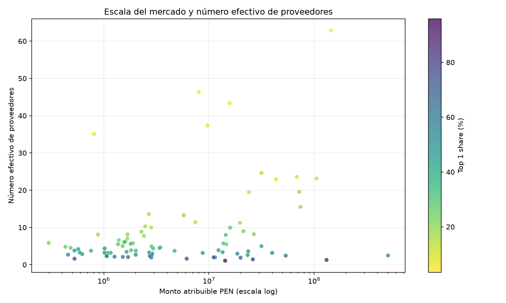

# Market Concentration — OECE/SEACE V3, source_period 2026-07

> HHI y participaciones son descripciones del snapshot por categoría estándar. No constituyen una conclusión legal, anticompetitiva ni de conducta del proveedor.

## Cobertura

| Métrica | Resultado |
| --- | --- |
| Mercados con monto atribuible | 772 |
| Mercados elegibles | 87 |
| Mercados no elegibles | 685 |
| Cobertura monetaria atribuible | 99.9979% |
| Validaciones HHI | 772/772 |

## Mayores mercados elegibles

| Código | Categoría | Monto | Proveedores | Top 1 | HHI | Prov. efectivos |
| --- | --- | --- | --- | --- | --- | --- |
| 72141001 | Servicios de construcción de pistas y carreteras nuevas | S/ 505,075,549.99 | 39 | 50.63% | 4,009.95 | 2.49 |
| 72141107 | Servicios de construcción y reparación de puentes | S/ 145,202,614.27 | 87 | 3.43% | 159.01 | 62.89 |
| 72121103 | Servicios de renovación y reparación de edificios comerciales y de oficinas | S/ 131,281,228.91 | 29 | 87.60% | 7,739.91 | 1.29 |
| 72141121 | Servicios de construcción de tuberías principales de agua | S/ 105,198,670.08 | 64 | 12.07% | 432.01 | 23.15 |
| 72121406 | Servicios de construcción de escuelas | S/ 74,180,828.60 | 52 | 18.83% | 644.14 | 15.52 |
| 72153102 | Servicios de construcción de campos deportivos interiores | S/ 72,151,714.08 | 76 | 16.35% | 511.15 | 19.56 |
| 72141003 | Servicios de mantenimiento de pistas y carreteras | S/ 68,486,060.00 | 74 | 9.19% | 423.77 | 23.60 |
| 72121101 | Servicios de construcción de nuevos edificios comerciales y de oficinas | S/ 53,670,670.02 | 36 | 63.30% | 4,072.86 | 2.46 |
| 72141128 | Servicio de remodelación  y/o construcción de plazas públicas | S/ 43,371,488.97 | 39 | 8.05% | 436.60 | 22.90 |
| 72121403 | Servicios de construcción de hospitales | S/ 39,906,391.97 | 32 | 53.58% | 3,145.66 | 3.18 |

## Mayor HHI entre mercados elegibles

| Código | Categoría | Monto | Proveedores | Top 1 | HHI |
| --- | --- | --- | --- | --- | --- |
| 78181901 | Reparación del sistema de frenos y rueda de ala giratoria de aeronaves | S/ 14,247,295.60 | 4 | 95.88% | 9,199.05 |
| 72121103 | Servicios de renovación y reparación de edificios comerciales y de oficinas | S/ 131,281,228.91 | 29 | 87.60% | 7,739.91 |
| 83121703 | Servicios relacionados con Internet | S/ 26,139,117.40 | 15 | 82.71% | 6,914.45 |
| 86101807 | Desarrollo de fuerza de trabajo del sector administrativo | S/ 527,020.00 | 4 | 77.17% | 6,203.75 |
| 83101508 | Agua potable para ciudad | S/ 6,143,828.63 | 5 | 77.01% | 6,132.75 |
| 76111501 | Servicios de limpieza de edificios | S/ 19,991,156.46 | 9 | 70.61% | 5,273.94 |
| 25101507 | Camiones ligeros o vehículos de utilidad deportiva | S/ 2,825,610.00 | 4 | 68.97% | 5,112.04 |
| 72152707 | Servicios de construcción de muros de retención | S/ 11,089,786.11 | 6 | 67.85% | 5,027.26 |
| 78101802 | Servicios de transporte regional o nacional en camión | S/ 11,393,951.90 | 15 | 69.49% | 5,007.54 |
| 50221101 | Granos de cereal | S/ 1,702,062.97 | 5 | 66.33% | 4,837.22 |

## Interpretación

- Top N share muestra qué porcentaje del monto atribuible corresponde a los N mayores proveedores.
- HHI suma los cuadrados de las participaciones porcentuales: aumenta cuando el monto se concentra.
- El número efectivo de proveedores es `10,000 / HHI`; traduce la distribución a un equivalente de proveedores de igual tamaño.
- La elegibilidad exige al menos 3 proveedores, 2 compradores, 5 ítems y 95% de cobertura monetaria atribuible.
- No se usan bandas legales ni se infiere colusión, irregularidad o riesgo del proveedor.

## Figuras

