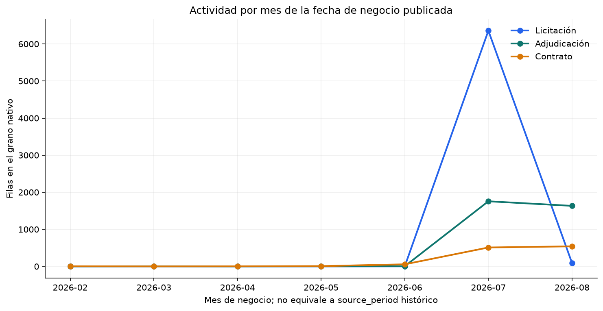

# EDA — OECE/SEACE V3, source_period 2026-07

> Reporte generado de forma reproducible desde SQL Server. Los rankings son descriptivos; no son KPIs, HHI ni recomendaciones.

## Universo

| Objeto | Filas |
|---|---|
| Procesos | 6,452 |
| Ítems de licitación | 7,359 |
| Adjudicaciones | 3,397 |
| Contratos | 1,119 |
| Compradores conocidos | 1,450 |
| Identidades proveedor/ofertante | 12,820 |
| Categorías conocidas | 3,689 |

## Perfiles monetarios

| Grano | Filas PEN | Ceros | Suma de control | Mediana | P90 | P99 | Máximo |
|---|---|---|---|---|---|---|---|
| Licitación | 6,452/6,452 | 1,779 | S/ 6,924,924,015.38 | S/ 98,743.77 | S/ 1,129,002.83 | S/ 11,264,604.72 | S/ 506,823,028.23 |
| Adjudicación | 3,397/3,397 | 0 | S/ 2,375,748,188.21 | S/ 143,280.00 | S/ 1,143,751.59 | S/ 6,312,740.73 | S/ 255,734,423.59 |
| Contrato | 1,115/1,119 | 0 | S/ 652,169,385.67 | S/ 99,450.00 | S/ 927,629.87 | S/ 4,840,932.97 | S/ 191,699,709.93 |

Las sumas anteriores son controles descriptivos por hecho y no deben sumarse entre etapas.

## Hallazgos exploratorios

- Los montos presentan una cola derecha pronunciada: la licitación tiene mediana S/ 98,743.77, p99 S/ 11,264,604.72 y máximo S/ 506,823,028.23; los valores extremos se conservan.
- 4,243 de 6,452 procesos tienen ofertantes observados; la mediana es 3, el p90 15 y el máximo 80.
- En 53 de 4,243 procesos comparables, el número declarado de ofertantes difiere del detalle observado.
- El monto contractual PEN está disponible en 1,115 de 1,119 contratos; el valor final de implementación falta en 1,116.
- El mayor comprador exploratorio por monto licitado es “DIRECCION GENERAL DE ELECTRIFICACION RURAL DEL MINISTERIO DE ENERGÍA Y MINAS”; el mayor proveedor atribuible por monto adjudicado es “CONSORCIO CONSTRUCTOR CAJAMARCA”. Son rankings de un snapshot, no medidas de concentración.
- La categoría estándar con mayor monto de ítems adjudicados en el piloto es 72141001 — Servicios de construcción de pistas y carreteras nuevas.
- Existe 1 contrato con fecha de firma posterior al snapshot; permanece visible para revisión de calidad temporal.
- Solo existe un source_period (2026-07); las fechas de negocio entre 2026-02-02 y 2026-08-31 no convierten el piloto en una serie histórica apta para crecimiento o comparación interanual.

## Principales compradores por monto licitado PEN

| Comprador | Procesos | Monto licitado |
|---|---|---|
| DIRECCION GENERAL DE ELECTRIFICACION RURAL DEL MINISTERIO DE ENERGÍA Y MINAS | 7 | S/ 691,945,109.15 |
| GOBIERNO REGIONAL DE JUNIN SEDE CENTRAL | 36 | S/ 570,123,016.92 |
| GOBIERNO REGIONAL DE CUSCO - DIRECCION REGIONAL DE TRANSPORTES Y COMUNICACIONES CUSCO | 26 | S/ 512,695,765.49 |
| MUNICIPALIDAD PROVINCIAL DE TOCACHE | 1 | S/ 353,247,788.59 |
| GOBIERNO REGIONAL DE CAJAMARCA UNIDAD EJECUTORA PROGRAMAS REGIONALES - PROREGION | 1 | S/ 255,734,423.59 |
| SERVICIO DE AGUA POTABLE Y ALCANTARILLADO DE LIMA - SEDAPAL | 21 | S/ 230,677,397.54 |
| MTC-PROYECTO ESPECIAL DE INFRAESTRUCTURA DE TRANSPORTE NACIONAL (PROVIAS NACIONAL) | 15 | S/ 194,632,358.83 |
| GOBIERNO REGIONAL DE UCAYALI SEDE CENTRAL | 22 | S/ 170,692,840.64 |
| GOBIERNO REGIONAL DE PUNO SEDE CENTRAL | 90 | S/ 162,375,830.27 |
| OFICINA NACIONAL DE PROCESOS ELECTORALES | 8 | S/ 137,576,369.60 |

## Principales proveedores atribuibles por monto adjudicado PEN

| Proveedor | Adjudicaciones | Compradores | Monto adjudicado |
|---|---|---|---|
| CONSORCIO CONSTRUCTOR CAJAMARCA | 1 | 1 | S/ 255,734,423.59 |
| CONSORCIO CARRETERO CHECCA MAZOCRUZ | 1 | 1 | S/ 191,699,709.93 |
| ADMINISTRADOR DE PROCESOS ELECTORALES CSA | 1 | 1 | S/ 115,000,000.00 |
| BAKER BOTTS LLP | 3 | 1 | S/ 40,354,600.00 |
| CONSORCIO Z&S | 1 | 1 | S/ 33,972,402.22 |
| HMF SMART SOLUTIONS GMBH SUCURSAL DEL PERU | 1 | 1 | S/ 29,492,499.54 |
| CONSORCIO EJECUTOR CELENDIN | 1 | 1 | S/ 26,129,073.02 |
| AMERICA MOVIL PERU S.A.C. | 2 | 2 | S/ 21,809,098.00 |
| CONSORCIO EL SALVADOR | 1 | 1 | S/ 21,381,630.35 |
| CONSORCIO LOS TUCOS I | 1 | 1 | S/ 20,237,773.81 |

## Principales categorías estándar por monto de ítems adjudicados PEN

| Código | Descripción | Ítems | Monto |
|---|---|---|---|
| 72141001 | Servicios de construcción de pistas y carreteras nuevas | 39 | S/ 505,075,549.99 |
| 72141107 | Servicios de construcción y reparación de puentes | 87 | S/ 145,202,614.27 |
| 72121103 | Servicios de renovación y reparación de edificios comerciales y de oficinas | 30 | S/ 131,281,228.91 |
| 72141121 | Servicios de construcción de tuberías principales de agua | 64 | S/ 105,198,670.08 |
| 72121406 | Servicios de construcción de escuelas | 52 | S/ 74,180,828.60 |
| 72153102 | Servicios de construcción de campos deportivos interiores | 76 | S/ 72,151,714.08 |
| 72141003 | Servicios de mantenimiento de pistas y carreteras | 76 | S/ 68,486,060.00 |
| 72121101 | Servicios de construcción de nuevos edificios comerciales y de oficinas | 38 | S/ 53,670,670.02 |
| 80121704 | Servicios legales de contratos | 5 | S/ 43,754,022.00 |
| 72141128 | Servicio de remodelación  y/o construcción de plazas públicas | 39 | S/ 43,371,488.97 |

## Cobertura y calidad relevante

| Métrica | Casos | Denominador | % | Interpretación |
|---|---|---|---|---|
| award_item_standard_category_unknown | 648 | 3590 | 18.0501 | Ítems adjudicados sin clasificación estándar. |
| award_supplier_not_attributable | 1 | 3397 | 0.0294 | Adjudicaciones sin atribución monetaria segura a un proveedor único. |
| buyer_department_raw_missing | 0 | 1450 | 0.0000 | Compradores sin departamento publicado; el texto todavía no está homologado con UBIGEO. |
| contract_final_value_missing | 1116 | 1119 | 99.7319 | Contratos sin valor final de implementación. |
| contract_item_standard_category_unknown | 205 | 1139 | 17.9982 | Ítems contractuales sin clasificación estándar. |
| contract_pen_missing | 4 | 1119 | 0.3575 | Contratos sin monto PEN calculable con evidencia OECE. |
| contract_signed_after_snapshot | 1 | 1119 | 0.0894 | Contratos cuya fecha de firma publicada es posterior al snapshot. |
| tender_item_standard_category_unknown | 1282 | 7359 | 17.4208 | Ítems de licitación sin clasificación estándar. |
| tender_zero_original | 1752 | 6452 | 27.1544 | Procesos con monto original de licitación igual a cero. |
| tenderer_declared_observed_difference | 53 | 4243 | 1.2491 | Procesos comparables cuyo conteo declarado difiere del detalle observado. |

## Figuras

## Aptitud para fases siguientes

- EDA descriptivo de demanda, compradores, proveedores, categorías y competencia: apto con las coberturas publicadas.
- Crecimiento, YoY y recurrencia histórica: no aptos con un solo source_period.
- Geografía: solo texto crudo exploratorio; requiere dimensión oficial UBIGEO.
- Valor final contractual: no apto por cobertura insuficiente.
- HHI, concentración y scores: deliberadamente no calculados en esta fase.
