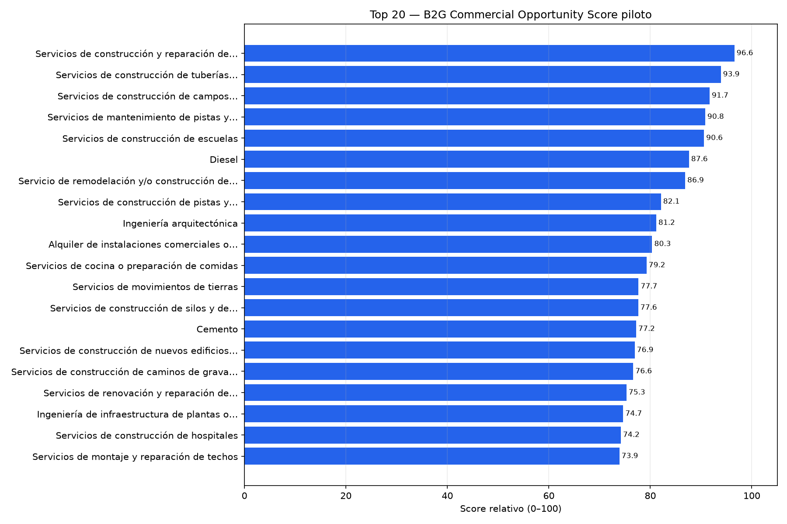
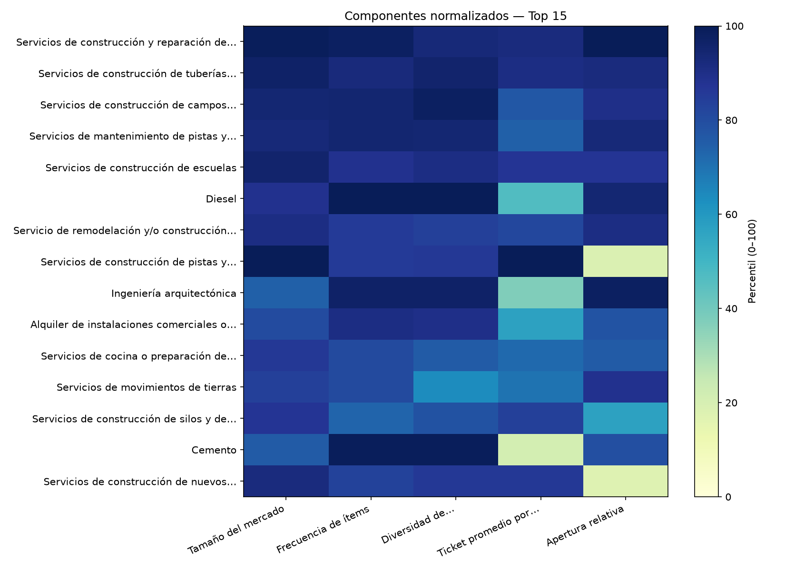
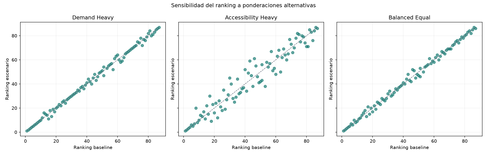

# B2G Commercial Opportunity Score — piloto 2026-07

> Score relativo y explicable dentro de 87 mercados elegibles. No es pronóstico de ventas, probabilidad de adjudicación, retorno financiero ni recomendación automática.

## Metodología

- Tamaño de mercado: 30%.
- Frecuencia de ítems: 20%.
- Diversidad de compradores: 20%.
- Ticket promedio por ítem: 15%.
- Apertura relativa, inversa a HHI: 15%.
- Normalización: percentil 0–100 dentro de la población elegible.
- Crecimiento y recurrencia: excluidos por falta de periodos comparables.

## Top 20 relativo

| Rank | Código | Categoría | Monto | Compradores | HHI | Score | Banda |
| --- | --- | --- | --- | --- | --- | --- | --- |
| 1 | 72141107 | Servicios de construcción y reparación de puentes | S/ 145,202,614.27 | 53 | 159.01 | 96.57 | HIGHER_RELATIVE |
| 2 | 72141121 | Servicios de construcción de tuberías principales de agua | S/ 105,198,670.08 | 59 | 432.01 | 93.90 | HIGHER_RELATIVE |
| 3 | 72153102 | Servicios de construcción de campos deportivos interiores | S/ 72,151,714.08 | 61 | 511.15 | 91.69 | HIGHER_RELATIVE |
| 4 | 72141003 | Servicios de mantenimiento de pistas y carreteras | S/ 68,486,060.00 | 56 | 423.77 | 90.81 | HIGHER_RELATIVE |
| 5 | 72121406 | Servicios de construcción de escuelas | S/ 74,180,828.60 | 45 | 644.14 | 90.58 | HIGHER_RELATIVE |
| 6 | 15101505 | Diesel | S/ 31,555,671.22 | 107 | 405.72 | 87.62 | HIGHER_RELATIVE |
| 7 | 72141128 | Servicio de remodelación  y/o construcción de plazas públicas | S/ 43,371,488.97 | 32 | 436.60 | 86.86 | HIGHER_RELATIVE |
| 8 | 72141001 | Servicios de construcción de pistas y carreteras nuevas | S/ 505,075,549.99 | 34 | 4,009.95 | 82.09 | HIGHER_RELATIVE |
| 9 | 81101508 | Ingeniería arquitectónica | S/ 15,700,018.24 | 60 | 230.64 | 81.16 | HIGHER_RELATIVE |
| 10 | 80131502 | Alquiler de instalaciones comerciales o industriales | S/ 21,286,266.78 | 43 | 1,108.15 | 80.35 | HIGHER_RELATIVE |
| 11 | 91111603 | Servicios de cocina o preparación de comidas | S/ 26,731,001.94 | 19 | 1,217.45 | 79.24 | HIGHER_RELATIVE |
| 12 | 72141505 | Servicios de movimientos de tierras | S/ 23,999,987.12 | 12 | 513.76 | 77.67 | HIGHER_RELATIVE |
| 13 | 72121203 | Servicios de construcción de silos y de edificaciones para servicio agrícola | S/ 31,546,622.06 | 21 | 2,006.16 | 77.62 | HIGHER_RELATIVE |
| 14 | 30111601 | Cemento | S/ 15,884,015.71 | 89 | 1,004.97 | 77.21 | HIGHER_RELATIVE |
| 15 | 72121101 | Servicios de construcción de nuevos edificios comerciales y de oficinas | S/ 53,670,670.02 | 34 | 4,072.86 | 76.92 | HIGHER_RELATIVE |
| 16 | 72141106 | Servicios de construcción de caminos de grava o tierra | S/ 19,710,362.97 | 21 | 886.74 | 76.63 | HIGHER_RELATIVE |
| 17 | 72121103 | Servicios de renovación y reparación de edificios comerciales y de oficinas | S/ 131,281,228.91 | 22 | 7,739.91 | 75.29 | HIGHER_RELATIVE |
| 18 | 81101515 | Ingeniería de infraestructura de plantas o instalaciones | S/ 9,668,694.40 | 49 | 267.68 | 74.65 | MEDIUM_RELATIVE |
| 19 | 72121403 | Servicios de construcción de hospitales | S/ 39,906,391.97 | 19 | 3,145.66 | 74.19 | MEDIUM_RELATIVE |
| 20 | 72152605 | Servicios de montaje y reparación de techos | S/ 14,452,679.30 | 29 | 1,247.21 | 73.90 | MEDIUM_RELATIVE |

## Sensibilidad

| Escenario | Correlación de ranking | Coincidencia Top 10 | Cambio medio | Cambio máximo |
| --- | --- | --- | --- | --- |
| demand_heavy | 0.9972 | 10/10 | 1.24 | 5 |
| accessibility_heavy | 0.9652 | 9/10 | 5.21 | 16 |
| balanced_equal | 0.9970 | 10/10 | 1.43 | 6 |

Los cambios de ranking muestran dependencia de preferencias de negocio; el reporte conserva los tres escenarios y la variación por mercado.

## Figuras

