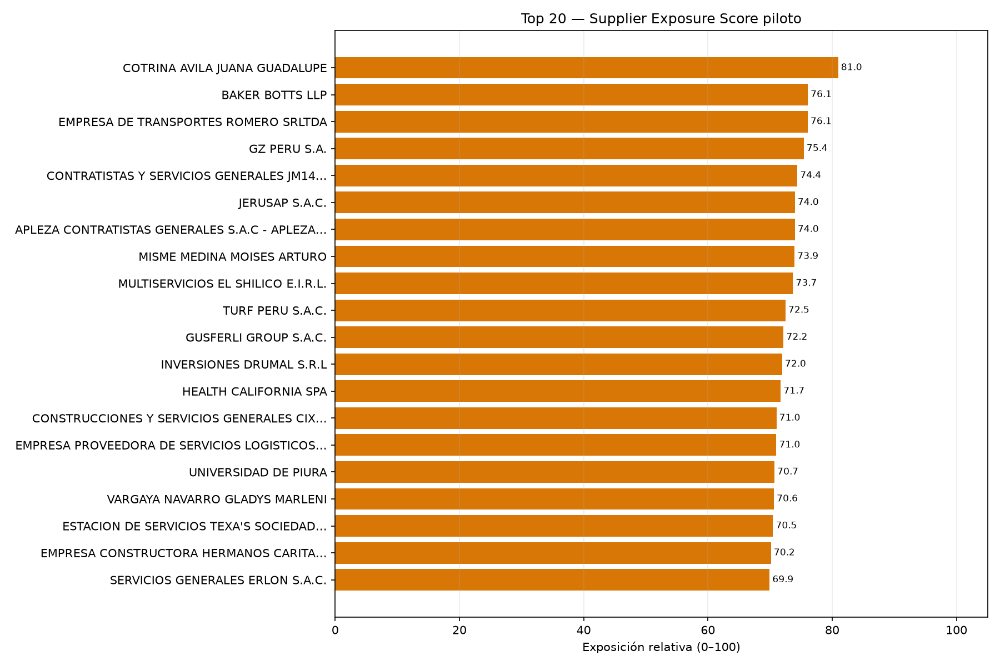
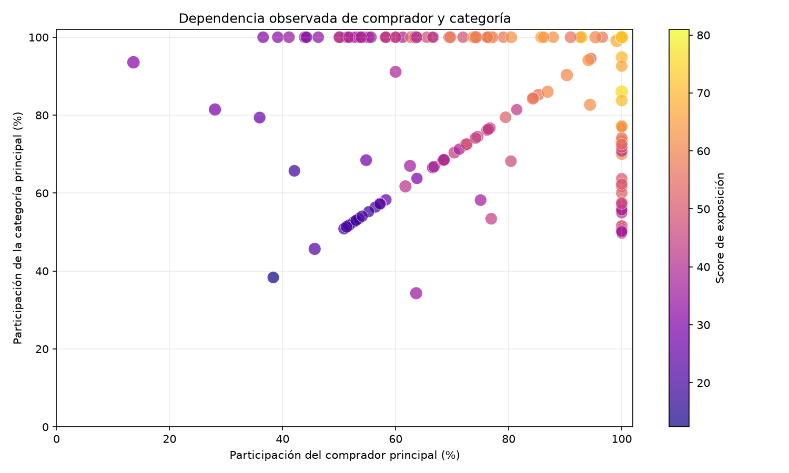
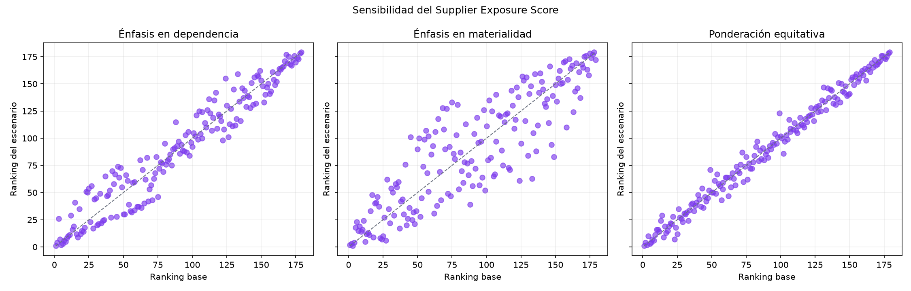

# Supplier Operational and Commercial Exposure Score — piloto 2026-07

> **Advertencia:** El indicador no constituye una calificación crediticia, evaluación legal, acusación de irregularidad ni predicción de fraude.

El score ordena exposición relativa observada; no demuestra que un proveedor sea riesgoso, irregular, insolvente o responsable de conducta indebida.

Los insumos se reconstruyeron desde la capa Silver auditada y se reconciliaron con los conteos del modelo dimensional. Los SQL incluidos son contratos de consulta reproducibles, pero no se ejecutaron en esta corrida por presión de memoria de la instancia local.

## Componentes

- Materialidad adjudicada: 20%.
- Dependencia del principal comprador: 30%.
- Dependencia de categoría: 25%.
- Concentración entre adjudicaciones: 15%.
- Amplitud limitada de compradores: 10%.

## Top 20 relativo

| Rank | Proveedor | Adjudicaciones | Compradores | Monto | Top buyer | Top categoría | Score | Banda |
| --- | --- | --- | --- | --- | --- | --- | --- | --- |
| 1 | COTRINA AVILA JUANA GUADALUPE | 2 | 1 | S/ 814,315.00 | 100.00% | 100.00% | 80.97 | HIGHER_RELATIVE |
| 2 | BAKER BOTTS LLP | 3 | 1 | S/ 40,354,600.00 | 100.00% | 100.00% | 76.08 | HIGHER_RELATIVE |
| 3 | EMPRESA DE TRANSPORTES ROMERO SRLTDA | 2 | 1 | S/ 9,202,678.24 | 100.00% | 86.03% | 76.07 | HIGHER_RELATIVE |
| 4 | GZ PERU S.A. | 2 | 1 | S/ 11,145,315.64 | 100.00% | 100.00% | 75.44 | HIGHER_RELATIVE |
| 5 | CONTRATISTAS Y SERVICIOS GENERALES JM14 S.A.C.S | 2 | 1 | S/ 427,437.50 | 100.00% | 100.00% | 74.40 | HIGHER_RELATIVE |
| 6 | JERUSAP S.A.C. | 2 | 1 | S/ 413,700.00 | 100.00% | 100.00% | 74.00 | HIGHER_RELATIVE |
| 7 | APLEZA CONTRATISTAS GENERALES S.A.C - APLEZA S.A.C. | 2 | 1 | S/ 487,190.00 | 100.00% | 100.00% | 74.00 | HIGHER_RELATIVE |
| 8 | MISME MEDINA MOISES ARTURO | 2 | 1 | S/ 426,920.00 | 100.00% | 100.00% | 73.95 | HIGHER_RELATIVE |
| 9 | MULTISERVICIOS EL SHILICO E.I.R.L. | 2 | 1 | S/ 740,686.68 | 100.00% | 100.00% | 73.69 | HIGHER_RELATIVE |
| 10 | TURF PERU S.A.C. | 2 | 1 | S/ 601,124.00 | 100.00% | 100.00% | 72.49 | HIGHER_RELATIVE |
| 11 | GUSFERLI GROUP S.A.C. | 2 | 1 | S/ 494,000.00 | 100.00% | 100.00% | 72.18 | HIGHER_RELATIVE |
| 12 | INVERSIONES DRUMAL S.R.L | 2 | 2 | S/ 2,454,625.20 | 92.85% | 100.00% | 71.95 | HIGHER_RELATIVE |
| 13 | HEALTH CALIFORNIA SPA | 2 | 1 | S/ 2,131,833.60 | 100.00% | 100.00% | 71.71 | HIGHER_RELATIVE |
| 14 | CONSTRUCCIONES Y SERVICIOS GENERALES CIX EMPRESA INDIVIDUAL DE RESPONSABILIDAD LIMITADA | 3 | 1 | S/ 2,139,381.23 | 100.00% | 100.00% | 71.03 | HIGHER_RELATIVE |
| 15 | EMPRESA PROVEEDORA DE SERVICIOS LOGISTICOS EN MINERIA E INDUSTRIA DEL PERU EIRL - PROSELMIN-PERU EIR | 2 | 1 | S/ 793,548.00 | 100.00% | 83.78% | 71.01 | HIGHER_RELATIVE |
| 16 | UNIVERSIDAD DE PIURA | 2 | 1 | S/ 406,700.00 | 100.00% | 100.00% | 70.72 | HIGHER_RELATIVE |
| 17 | VARGAYA NAVARRO GLADYS MARLENI | 2 | 1 | S/ 200,745.10 | 100.00% | 100.00% | 70.63 | HIGHER_RELATIVE |
| 18 | ESTACION DE SERVICIOS TEXA'S SOCIEDAD ANONIMA CERRADA | 4 | 1 | S/ 1,510,740.00 | 100.00% | 94.86% | 70.48 | HIGHER_RELATIVE |
| 19 | EMPRESA CONSTRUCTORA HERMANOS CARITA SOCIEDAD COMERCIAL DE RESPONSABILIDAD LIMITADA | 2 | 1 | S/ 317,500.00 | 100.00% | 100.00% | 70.15 | HIGHER_RELATIVE |
| 20 | SERVICIOS GENERALES ERLON S.A.C. | 2 | 1 | S/ 320,043.80 | 100.00% | 100.00% | 69.93 | HIGHER_RELATIVE |

## Sensibilidad

| Escenario | Correlación | Top 10 común | Cambio medio | Cambio máximo |
| --- | --- | --- | --- | --- |
| dependency_heavy | 0.9653 | 9/10 | 10.59 | 31 |
| materiality_heavy | 0.8771 | 4/10 | 20.16 | 70 |
| balanced_equal | 0.9923 | 8/10 | 4.72 | 24 |

Sanciones, penalidades, recurrencia y cambios abruptos no se calculan porque sus fuentes o periodos no están disponibles. El escenario con énfasis en materialidad presenta sensibilidad alta; el orden no debe interpretarse como una clasificación estable fuera del periodo observado.

## Figuras

